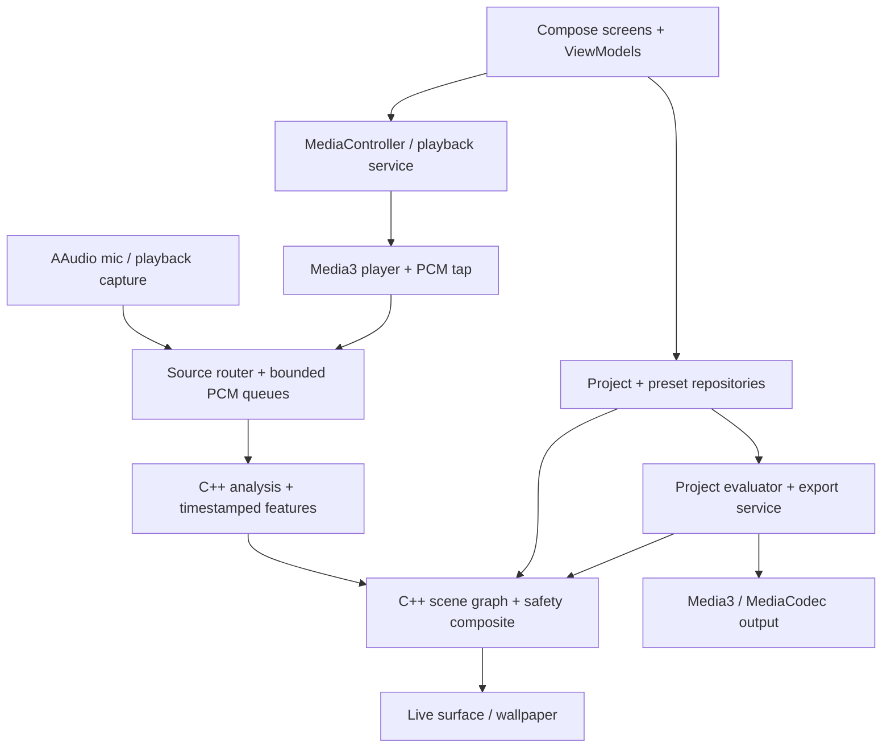

# Android and native architecture

Target architecture. Preserve working modules and migrate by feature contracts.
Use C++ for real-time DSP/analysis/rendering, Kotlin for platform integration and
Compose UI. C++ does not replace Android lifecycle, permission or media APIs.

## Ownership

| Boundary | Responsibility | Prohibited dependency |
|---|---|---|
| `:app` presentation | Compose, navigation, ViewModels, permission launchers | No native handles or long-lived playback rules in composables |
| Playback service/domain | Queue, focus, noisy handling, prefs, history, A-B, timer, recovery | No Activity requirement |
| `:engine:audio-android` | Media3 PCM tap, capture permission/service, clocks, JNI adapters | No UI state |
| `:engine:audio-core` + `core/analysis` | Typed PCM, DSP, feature production, bounded buffers | No Android Context in portable C++ |
| `:engine:scenes` + `core/viz` | Scene contract, GPU resources, GL thread, deterministic evaluation | No playback ownership or storage scans |
| Studio domain | Immutable project snapshot, clip/time evaluation, commands/undo | No separate interpretation of time in preview and export |
| Data | Repositories, migrations, imports, atomic persistence | No UI callbacks inside storage transactions |
| Optional integrations | Billing, identity, Drive adapters behind interfaces | No blocking dependency of offline playback |

Keep current modules initially. Introduce `:feature:studio`, `:feature:player`,
`:core:data` or `:integration:*` only after their interfaces are proven. Module
count is not a quality objective.

## Media3 and AAudio have distinct jobs

**Music:** ExoPlayer decodes and outputs local music, publishes one MediaSession
and supplies PCM through an AudioProcessor. The service owns preferences and
transport rules. UI, notification, widget and Auto are clients. Handle focus and
becoming-noisy in the same lifetime as the player. Do not create a second audible
native output of the same PCM.

**Microphone:** on Android 9+ an AAudio (NDK) input stream opens in low-latency
performance mode. It tries exclusive, then shared, and accepts the actual sample
rate, channel count and format. Android 8.x, and any device where AAudio does not
open, uses AudioRecord (`MicSourcePlan`). There is no data callback. The pump's
reader thread runs at urgent-audio priority. It makes blocking reads with a 40 ms
timeout, so `stop()` stays responsive. After a route change (disconnect) that same
thread closes the stream and reopens it with backoff, and it reports a new sample
rate before the first chunk at that rate. Request microphone permission only on
source selection; default capture ends when its visible experience ends.
Background capture, if added, requires its own valid microphone foreground service
and launch rules.

**Other-app audio:** Android playback capture uses AudioRecord + MediaProjection
consent on supported devices. AAudio does not grant cross-app capture permission.
DRM/private/ineligible playback remains unavailable. On token revocation stop
capture immediately, clear stale features and tell the UI.

**Migration:** the Oboe-backed NativePlayer, bit-perfect output, crossfade and the
Oboe dependency are removed (PR #10). The saved engine preference is ignored and
playback runs on Media3.

## PCM, analysis and clocks

Each block carries source ID, epoch, first sample index, frames, channels, actual
sample rate and monotonic capture/presentation timestamp. Units must be explicit:
frames are not interleaved samples or bytes. JNI validates bounds before access.

1. A source coordinator grants a single producer lease. Switching sources or
   seeking increments epoch, flushes queues and resets history. Old callbacks
   cannot publish into the new epoch.
2. Playback PCM is tapped after app DSP for the default “hear what you see”
   contract. If a pre-DSP analysis mode is retained, name it explicitly and use
   the same choice during export. Hardware/output-device EQ is outside this tap.
3. Audio callback writes to a bounded SPSC queue. Analysis runs on its own worker;
   never perform FFT, storage or JNI allocation on the callback.
4. Live overload discards old analysis blocks and records a discontinuity;
   it must never block audible output. Offline export uses backpressure and must
   process every frame. Do not reuse the live drop policy for export.
5. Feature frames include audio sample position, confidence, RMS/bands/FFT,
   rhythm/structure and source epoch. Render consumes the newest eligible frame
   at presentation time, not the newest decoded frame.
6. Account for output buffering, speed, seeks and Bluetooth route latency. Use
   Media3 sink presentation information where available. Unsupported clocks need
   an explicit fallback/calibration, not a fabricated accuracy claim.
7. Pass each PCM chunk to projectM exactly once. A render tick with no new audio
   advances visual time without feeding the previous audio repeatedly.
8. On stop/release: disarm producer, stop stream, drain/cancel worker, join its
   completion, then destroy native state. Repeated teardown is idempotent.

### Buffer contract and sizing

Existing `PlaybackSession.sampleRing` holds 65,536 stereo frames; at 48 kHz that
is about 1.37 seconds of capacity, not a desired 1.37-second latency. Its maximum
write is 16,384 frames. Inventory all producers before replacing it.

| Buffer | Units / producer → consumer | Required behavior |
|---|---|---|
| AAudio input stream buffer | PCM frames; HAL → mic reader thread (blocking read, one burst per read) → `SampleRing` | Two bursts (the HAL's own buffer); reads bounded to 64–1,024 frames; a reopen at another rate is reported before its first chunk |
| Media3 tap queue | PCM frames; audio render thread → analyzer | Nonblocking; epoch/rate transition; bounded downmix and chunking |
| FFT window/history | Frames; analyzer worker only | Size selected by frequency resolution/latency; hop tied to samples, not wall-clock polling |
| Feature history | Timestamped frames; analyzer → renderer | Bounded enough for output lead and smoothing; deterministic interpolation; preserve event IDs |
| Touch/parameter commands | Small commands; UI → GL | Coalesce continuous values; preserve begin/end; bounded queue |
| Export staging | Decoded frames/audio; decode → render/encoder | Backpressure, cancellation and explicit memory cap; never silently drop content |

Initial sizing formula: capacityFrames = nextPowerOfTwo(sampleRate × jitterBudget
seconds + largestProducerBlock + FFTWindow). Validate measured occupancy and
underruns; this is a tuning rule, not a reason to always choose large buffers.

## Renderer contract

Each scene exposes stable ID/schema version, capabilities, universal parameter
mappings, GPU requirements, seeded state, `prepare`, `resize`, `renderAt` and
`release`. GL resources are created/destroyed on the owning GL thread. CPU scene
state survives surface replacement; context loss recreates resources and restores
preset/seed instead of silently resetting the user's look.

Render order: source layers → simulation/geometry → trails → bounded bloom →
colour/tone mapping → overlays as specified → final safety composite. Apply
reduced-motion and flash policy consistently across every family and export.
Budget bloom/history buffers per quality tier. Cache shader programs by source,
capability and driver identity, and invalidate safely.

Universal macros map through per-scene adapters; do not send unused uniforms and
declare a control implemented. Rotation rate and rotation angle are separate
quantities. Camera director uses time-based easing, bounded velocity/acceleration,
and seeded paths. Gyro offsets a stable camera rig and has recenter/disable.

## Studio: one evaluator, two consumers

Project data contains stable IDs, schema version, rational frame rate, canvas,
asset references, lane ordering, clip start/end/in/out, keyframes, transitions,
audio gain and colour configuration. Store time as integer microseconds or
rational ticks; do not accumulate floating-point frame durations.

For frame `n`, presentationTimeUs = floor(n × 1,000,000 × fpsDen / fpsNum).
The project evaluator resolves active clips and maps project time to clip-local
time including trim and speed curves. Empty timeline intervals remain empty.
Moving/splitting/deleting a clip also transforms or removes its keyed tracks.

Preview and export use that evaluator. Prototype Media3 CompositionPlayer and
Transformer for supported media sequences. Feed native visual layers through an
explicit texture/frame adapter; where direct integration is not supported,
pre-render a deterministic visual intermediate. Do not pretend a Media3
Composition automatically renders the custom C++ scene graph.

Export owns a snapshot, offscreen EGL context/resources, encoder, muxer and temp
files. Live playback must not mutate this snapshot. Validate all lanes/effects
before starting. Publish through MediaStore only after successful muxer close;
on cancel/error clear pending output and retain the project. Store job status so
UI refresh cannot erase the result. Long-running processing follows platform
service time limits and cancellation requirements.

## Persistence and integrations

- Preserve existing JSON/SharedPreferences formats during migration. Add schema
  versions, stable UUIDs and atomic writes. Only switch to Room/DataStore with
  migration fixtures and rollback/recovery behavior.
- Store URI grants and asset fingerprints; backup references cannot recreate
  permission on a different device. Restore prompts the user to relink files.
- Never overwrite on import. Limit ZIP expanded size/count, reject path traversal,
  validate preset schema, clamp numeric values and preserve unknown/newer files.
- EntitlementRepository publishes free/pending/premium/expired/error state.
  Play purchases are distinct from optional Google identity. Production-grade
  verification/revocation uses a backend and Play Developer APIs; the historical
  client-only option must explicitly accept its reduced trust/revocation model.
- Credential Manager authenticates identity; Drive requires separate authorization.
  Backups contain user-chosen app data, not uploaded music or microphone recordings
  by default. Cloud conflict resolution is previewed before replacing local data.

## Observability and tests

Expose opt-in local diagnostics: source/rate, queue occupancy/drops, render timing,
quality tier, GL/codec capability, capture error and export state. Do not log
tokens, purchase payloads, full local file paths or audio contents.

Test portable C++ DSP/math and scheduling on host; Kotlin state/repository logic
with virtual time; Android service/permission/media behavior in instrumentation;
GPU/audio quality on physical devices. Preserve build SHA, device/OS, fixture,
settings and exact outcome for every release gate.
