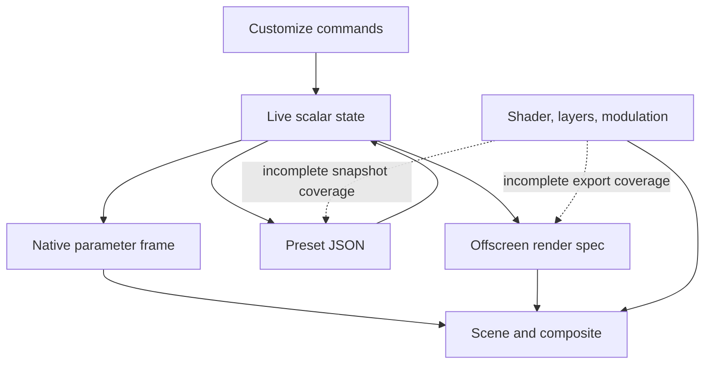

# Customization: source audit and implementation contract

**7 October 2026 — source review and proposed implementation, not device validation.**
The audit baseline is commit `97dc5d4`. Runtime findings below describe the code
read at that baseline; an intended native fix is not treated as shipped. This
document adds detail to [DESIGN.md](DESIGN.md), [FEATURE_SPEC.md](FEATURE_SPEC.md),
[ARCHITECTURE.md](ARCHITECTURE.md) and [the rebuild plan](../rebuild/PLAN.md).
The user's current first gate is a working downloadable debug APK. This audit
does not change application code, dependencies, workflows or renderer behavior.
No local build, test, emulator run or lint was performed.

Later source review and corrections: [APP_BUG_CONFIG_AUDIT.md](APP_BUG_CONFIG_AUDIT.md).
The main library Save path already confirms replacement, while Customize Save
still needs a repository-level copy/update distinction. Palette names already
use the hashed sanitizer, so the earlier simple punctuation-collision claim is
superseded. Keep all existing native styles; follow the new camera contract for
generative live motion and capture of realized performance.

## 1. What is already usable, and what blocks a complete experience

Geode has a substantial customization implementation: scene-aware advanced tabs,
cross-tab search, palette editing, parameter locks, randomization, undo/redo,
A/B snapshots, native modulation, persistent scalar parameters and offscreen
rendering through the same C++ renderer. Replacing these with decorative sliders
would lose useful functionality. The needed rebuild is a coherent state and
capability contract, followed by the canvas-first interaction in the design.

Confirmed gaps are more fundamental than styling:

1. **Visible controls do not always affect the image.** Form drive has no runtime
   consumer. Shader beat response is uploaded as zero. Composite pulse, shake
   and flash have a disconnected input. Several active controls have a large
   slider range beyond the final safety clamp.
2. **A saved look is incomplete.** The preset envelope omits modulation, layers
   and fluid injection shaders. Applying another preset does not clear an
   existing custom shader when the incoming preset has none.
3. **Custom shader state belongs to a renderer instance.** Live-state persistence
   explicitly serializes a null shader; an event can be missed with no collector;
   the export renderer does not receive custom shader source.
4. **Save/import can report completion without durable success.** Save returns
   no result. Import chooses names from a potentially incomplete UI list and
   publishes a preset before its write finishes.
5. **The five designed macros do not exist yet.** Existing fields named speed,
   audio drive or motion amount are not substitutes for the specified zero/off
   semantics. Depth needs actual per-family rendering work.

The first repair after the APK gate should make existing controls and Save copy
truthful. A second slice must make the complete look durable and exportable.
The five-macro UI comes after scene adapters prove their meanings.

## 2. Evidence trail through the application

Paths in this section are relative to the repository root.

| Stage | Source and actual behavior |
|---|---|
| Choose a style | `ui/VisualsHub.kt` delegates through `VisualsViewModel`/`PlayerSession` to `VisualSettingsController.selectScene`. It changes `VizUiState.sceneId`; parameters remain global rather than resetting to a distinct style document. |
| Edit a scalar | `CustomizePanel` supplies scene/search/lock context. `CustomizeTabBody` sends `SceneParams.copy(...)` through `VisualsViewModel.editSceneParams` → `ModulationController.editSceneParams` → `VisualSettingsController.setSceneParams`. |
| Commit and retain | The controller updates `VizStateStore.state` and requests a debounced write. `VizStateStore` serializes the scalar look after 400 ms and has an explicit flush path. Its `SharedPreferences.commit()` result is ignored. |
| Attach live renderer | `ui/EnginePlumbing.kt` collects the state and assigns `VisualizerRenderer.requestedSceneId` and `sceneParams`. Separate collectors send LFO/ADSR, layers, transition and reduced-motion state. |
| Cross JNI | `VisualizerRenderer.syncNativeState` sends changed parameters to `NativeViz.setParams`; `SceneParamsCodec` packs 140 numeric fields. `NativeViz.create` verifies the native field names/order. `core/api/geode_viz_api.cpp` accepts exactly the field count and calls native `SceneParams.set`. This is layout verification, not complete value validation. |
| Evaluate native look | `core/viz/RendererFrame.cpp::resolveParams` applies parameter interpolation, LFO, ADSR, `MotionField`, safety limits and thermal optional-pass restrictions. Scenes receive these effective parameters. `CompositeGrade` selects which effects are done by a scene and which are applied to its finished texture. |
| Draw | Shader families use `core/viz/scenes/ShaderScene.cpp`, scene GLSL and common includes. Fluid, Water, Curl Flow, Silk, Myco, Life, Acid, Cymatics and MilkDrop have their own C++ consumers. `CompositePass.cpp`/`composite_frag.glsl` handle shared post effects. |
| Save named preset | `PresetLibraryController.savePreset` snapshots scene/params/attack/decay and receives shader source separately from the view's renderer. It may embed MilkDrop source, then calls `PresetRepository.save` → `PresetStore.save` → `AtomicWrite.text`. |
| Restore named preset | `VisualSettingsController.applyPreset` restores scalar state, queues a morph event, and conditionally sends shader/MilkDrop apply events. It does not restore a complete customization document. |
| Export | `ExportController` passes scene parameters and current LFO/ADSR to `VideoExporter`. `VisualizerRenderer.exportSceneFactory` carries only scene ID and MilkDrop path. `OffscreenRenderSpec` carries parameters, frame timing, modulation and reduced motion. `OffscreenSceneRenderer.prepare` creates a separate native renderer; it never applies custom/injection shaders or layers. |

The main Kotlin UI paths above are under `app/src/main/java/dev/geode/`; native
bridge/render paths are under `engine/scenes/src/main/kotlin/dev/geode/`.

## 3. Current control matrix

**Reading the table:** “wired” means a source-level consumer was found, not that
pixel output, perceptual quality or every driver has been tested. All scalar
`SceneParams` rows travel through the common UI → state → 140-field JNI → native
path and are represented in `PresetStore` JSON and offscreen base parameters.
That serialization does not make a disconnected control functional.

`ParamScope.of` is shared by display, target selection and randomization, which
is a good foundation. Its default for an unknown key is `UNIVERSAL`; therefore a
missing registration silently advertises support. Family classification is
also too broad to prove what an arbitrary/custom fragment shader consumes.

| UI/control → model | Native/render consumer | Current conclusion and required behavior |
|---|---|---|
| Speed → `speed` | Scene update clocks, including `ShaderScene.shaderTime`; hidden for MilkDrop by `SCENE_CLOCK` | Wired for supported scenes. UI minimum is 0.05 and MotionField rescales speed from energy, so this is not a zero-holds-motion macro. |
| Zoom, Rotation → `zoom`, `rotation` | Shader view transforms; native family transforms and composite grade; rotation is integrated as a rate | Wired. Label rotation as rate with units, not an absolute camera angle. Actual zero/upper behavior must include MotionField's added drift. |
| Sway, Drift X/Y → `sway`, `driftX/Y` | Shader view helpers; composite geometry for non-shader families | Wired. Shader drift uses a bounded triangle trajectory while composite drift wraps UVs; the same label currently has different motion across families. Preserve this distinction until adapters normalize it. |
| Turbulence → `turbulence` | `TURBULENCE` scope limits to Shader/Myco/Acid/Curl Flow | Scoped and wired. Keep it an advanced family control, not a guaranteed universal force. |
| Beat pulse → `pulse` | Shader view helper multiplies by squared `uBeat`; composite uses `postBeatPulse` for gated families; native family consumers vary | Disconnected in shader and composite at baseline because beat input is zero. Do not label universally working after only a shader fix. |
| Beat shake → `shake` | Shader/composite geometry multiplies by `uBeat` | Disconnected in these shared paths at baseline. Reduced-motion scaling exists but cannot restore a missing signal. |
| Audio drive → `audioDrive` | Band/level scale in scene consumers; excluded from MilkDrop which consumes PCM | Wired but UI range 0.2–2.5 cannot turn audio off, and central MotionField uses feature data independently. Not the designed Response macro. |
| Form drive → `formDrive` | Packed, serialized and randomized; no active rendering reader found | **Inert.** Remove the control and superformula promise; retain legacy field for import compatibility until migration is defined. Stop randomizing it. |
| Beat response → `beatResponse` | Fluid emitters, MilkDrop beat sensitivity, multiple native scene reactions; shader upload explicitly zero | Mixed: active in native families, disconnected in shader families. Capability support must be based on the active implementation, not the old `UNIVERSAL` label. |
| Beat flash → `flash` | Shader `uFlash` depends on zero `uBeat`; composite flash likewise receives zero hit | Disconnected in shader/composite at baseline. Reintroducing luminance reaction needs output safety validation; do not bypass clamps to make a slider visible. |
| Bass/Mid/Treble gain → `bassGain/midGain/trebGain` | `RendererFrame.gainAdjusted`, then actual band readers | Explicit per-family reader scopes are present. They adjust these band fields, not every spectral/motion signal. Labels must not imply a full global EQ. |
| Envelope attack/decay → analyzer fields and `VizUiState.attack/decay` | `AnalysisEngine` via `VisualSettingsController.setReactivity` | Live control and named/live preset fields; outside `SceneParams`, undo and A/B. Export does not receive these fields as part of its render spec; analysis-envelope parity needs a separate test/contract. |
| Domain warp, Ripple, Twist → `warp/ripple/twist` | Shader view helpers or composite geometry | Wired shared paths; semantic deformation differs by family. Cannot prove support for arbitrary custom GLSL solely from uniform upload. |
| Kaleidoscope/Folds, Mirror, Tile, Pixelate → corresponding fields | Shader helpers, family transforms and gated composite | Wired shared paths. Folds require kaleidoscope enabled; these dependencies belong in capability metadata. |
| Morph → `morph` | Shader coordinate remap; `SHADER_LOOK` scope | Scoped/wired; not a 3D mesh morph or a universal material control. |
| March detail → `marchDetail` | `MarchBudget`/`uSteps` on explicitly listed marched scene IDs | Correctly scoped by style ID. This is a step budget, not universal structural detail. Keep export/performance caps explicit. |
| Particle shape/size/density → corresponding fields | Sprite-family consumers; density limited to Fluid | Existing scopes prevent most irrelevant rows. Native population/budget effect still needs visual and sustained-performance evidence. |
| Palette/Hue range → `palette`, overrides, `hueRange` | Scene palette helpers; MilkDrop tint pass | Wired, with a dependency: MilkDrop's own colors remain unchanged at tint 0. Explain this or put its palette controls behind the tint action. |
| Hue shift/cycle/rate → `colorShift/colorCycle/cycleSpeed` | Shader/family grading and composite grade as gated | Wired. MotionField may add audio-derived hue; a user disabling cycle has not disabled all color motion. |
| Palette 2/Blend, Colour map, Duotone → `palette2/paletteMix/paletteLut/duotone` | Shader palette consumers; `SHADER_LOOK` scope | Scoped/wired. Resolved custom palette hues are serialized, so deleting a palette library entry need not destroy a saved look. Palette ID/name management itself remains fragile. |
| Saturation/Gamma/Temperature, Invert/Solarize/Posterize → corresponding fields | Scene color functions plus gated composite | Wired. Require single-application tests for each family so effects are not doubled or omitted during transitions. |
| Brightness/Intensity/Contrast → corresponding fields | Shared final safety clamp then scene/composite grading | Wired but effective maxima are 1.25; sliders allow 2.0/2.0/2.5. Their upper tails cannot deliver additional change. Display effective ranges or expose a capped-request state. |
| Bloom → `bloom` | Shader/composite highlight boost; safety caps at 0.25 despite 0–1 UI | Wired with a plateau. This generic field is not the fluid bloom pipeline's separate intensity/threshold. Name the material result accurately. |
| Chroma/Vignette/Scanlines/Grain/Fisheye → corresponding fields | `CompositePass` and common screen post shader | Shared wired post effects. Validate scaling at portrait/landscape/export resolutions and preserve output order. |
| Glitch → `glitch` | Composite random displacement, constrained by safety | Wired with safety maximum 0.25 vs UI maximum 1.0. No guarantee of an unclipped requested range. |
| Strobe → `strobe` | Composite periodic luminance effect with capped depth/frequency | **Still active** despite comments calling it inert. Do not classify all legacy controls as dead from comments alone. Keep restrained defaults and measured safety acceptance. |
| Trails/Length/Echo → `trails/trailLength/trailZoom/trailWarp` | Persistent scene/trail pass, explicitly scoped | Wired advanced controls; other scene families do not inherit persistent feedback merely because they share a post stack. |
| Flow field and ripple overlay → enable/strength/force/curl and water fields | `Overlays`, FlowField/RippleSim, texture inputs to composite/scenes | Shared mechanisms exist; Fluid/Water exceptions are scoped. Thermal restrictions can disable optional passes. Show temporary quality limitation separately from an unsupported control. |
| Fade time → `paramFadeSec` | Native interpolation in `resolveParams` | Wired and persisted; excluded from randomization and consequently from the current inferred reset-tab ownership. Reset FX does not reset everything visible in FX. |
| `motionAmount`, `motionBreath`, `motionDrift`, `motionHue` | `MotionField.apply` changes several fields, zoom, rotation rate and hue | Packed/persisted/rendered but no corresponding Customize controls. An eventual Motion amount label must mean modulation amount, not master off. Speed modulation continues independently. |
| `motionOrbit` | Packed/persisted; no active scaling reader found | Do not expose. `uOrbit` is generated/uploaded independently; the existence of that uniform does not prove this parameter affects it. |

Native agent coordination: the proposed first native slice restores bounded
shader beat/spike envelopes and `beatResponse`, alongside fresh-analysis/PCM
handling. Composite pulse/shake/flash restoration is explicitly deferred until
its safety and preset mapping are verified. This document does not mark either
slice complete.

## 4. State completeness and destructive surprises

| Item | Live | Named preset | Restart | Video export |
|---|---|---|---|---|
| Scene ID and scalar params | StateFlow/native | Yes | Yes, debounced | Yes, selected factory/base params |
| Analyzer attack/decay | Separate analyzer | Yes | Yes | No explicit fields in offscreen spec; verify analysis configuration parity |
| LFO/ADSR configurations | Separate flows/native | **No** | Separate `LfoStore` | Current configurations passed, independent of preset |
| Parameter locks | Separate preferences | No | Yes | Not a render input |
| A/B and undo history | In-memory scalar snapshots | No | No | Resulting scalar values only |
| Custom scene GLSL | Renderer-managed source and apply event | Source passed by save UI | **No live-state shader** | **Not transferred** |
| Fluid force/dye GLSL | Direct renderer call from editor | **No** | Not in live-state document | **Not transferred** |
| Second scene/layer mix/blend | Global in-process `LayersBus` | **No** | **No durable layer state** | Active scene only; existing UI explicitly discloses this |
| MilkDrop source/path | Native load plus remembered path | Source can be embedded | Path restored if file remains | Factory carries local path; referenced texture portability still needs asset accounting |
| Transition choice/duration | Separate visual state/native | Not in `Preset` | Yes | Single-scene offscreen renderer uses a fixed transition request; project transitions require their own contract |
| Custom palette appearance | Resolved hue/span in params | Yes | Yes | Yes for scalar hue/span; library metadata is separate |

Specific failure chains:

* `MutableSharedFlow(extraBufferCapacity = 8)` has no replay. Buffer capacity
  does not make a shader apply event durable when no collector exists. A later
  renderer receives scalar state but no shader source. Restoring source must
  use state; shader compile requests/results may use events.
* `VizStateStore.write` constructs the live preset with `customShader = null`.
  `restore` has no shader field to retain. Persisting scalar changes therefore
  cannot preserve a custom shader across process death.
* `applyPreset` sends a shader event only for non-null source. Native sources
  are remembered per scene, so loading a built-in look for that same scene can
  keep the previous custom GLSL. A complete apply must explicitly choose the
  built-in program or a particular validated source hash.
* Undo/redo/A/B use only `SceneParams`. Attack/decay, modulators, layers, style,
  shader and transition edits bypass that history. `PlayerSession.applyPreset`
  calls the visual controller directly, despite history comments describing
  preset loads as discrete undo entries. Reset all also resets only scalars.
* History groups edits using a 700 ms gap, not pointer/keyboard edit boundaries.
  Two different controls changed rapidly can become one undo step. A drag with
  a pause can become several. Replace timing heuristics with edit transactions.
* Reset-tab ownership is inferred from randomized fields. Quality, fade and
  overlay master switches that are intentionally never randomized are not
  automatically restored by reset for their visible tab. Randomizability and
  section ownership need independent metadata.
* `CustomizeSummary.changedCount` compares against global scalar defaults. It
  is not a dirty flag against the loaded preset and excludes non-scalar edits.
  A built-in non-default preset immediately reads as changed.

## 5. Preset integrity, imports and migration

The existing `AtomicWrite` flushes and syncs a temporary file before rename,
and serializes writes to that destination path. Retain its previous-file
preservation property. The surrounding repository still needs a transaction
covering name allocation, references and result publication.

### Confirmed issues

* `Preset` has no immutable ID or schema version; names identify files, folders,
  shares, deletes and lookup. Save with an existing name overwrites. Save copy
  in the new design cannot be implemented by relabelling that action.
* `PresetStore.save` returns `Unit` and discards an `AtomicWrite.text == false`
  result. The UI closes its dialog immediately. Delete/move/folder operations
  also frequently discard filesystem failure.
* `importPresetJson` calculates a unique name from `vizState.presets`, publishes
  it optimistically, then launches persistence. Before `refreshInitial` returns,
  existing disk names may not be present. A collision can overwrite an existing
  file. Background relists can also replace a newer optimistic list.
* File import uses unbounded `readText`; link import has explicit compressed/
  inflated limits. File input needs at least equivalent bounded parsing. No
  remote fetch is needed or should be introduced for a shared look.
* The JSON reader has defaults but no version negotiation or central finite/range
  validation. An oversized numeric value can overflow when converted to Float;
  arbitrary scene IDs/enum indexes can reach downstream fallbacks. Defaults are
  not a migration policy and array/order verification is not input validation.
* `safeFileName` adds a short hash for sanitized preset names, reducing ordinary
  punctuation collisions. Legacy migration nevertheless skips an existing target
  without resolving/quarantining both identities; name-based `findFile` only
  finds the expected filename, while `list` reads any JSON file. A legacy entry
  can be visible yet not reliably addressable for delete/share/move.
* Mirror-to-folder removes the previous destination before creating/writing its
  replacement and suppresses failures. A failed backup can destroy the previous
  mirror while local save appears successful. SAF providers need their own
  staged-write/recovery strategy; a local rename guarantee does not transfer.
* `PaletteStore.idFor` uses a sanitized name without a stable generated ID, and
  `save` returns the palette despite a failed atomic write. Distinct punctuation
  or non-Latin names can collide. Existing resolved hues protect rendering, but
  not the palette library identity or success feedback.

### Required storage contract

1. **Identity:** generated immutable `presetId` and `revision`; display name is
   editable metadata. Local files use IDs. Names are bounded UTF-8 strings;
   unique display suffixes are chosen inside the repository transaction.
2. **Snapshot:** schema version, scene ID/revision, complete visual document,
   explicit built-in/custom shader mode, assets/content hashes, modulation,
   seed and capability requirements. No device-specific absolute path is a
   portable asset identity. Keep safety policy outside user overrides.
3. **Commands:** `saveCopy(snapshot, proposedName)`,
   `update(id, expectedRevision, snapshot)`, `importCopy(document)` and
   `delete(id, expectedRevision)` return typed success/conflict/failure. Only
   explicit Update may replace an existing preset. A failed write keeps the
   editor dirty and the old file intact.
4. **Concurrency:** one repository writer/transaction serializes allocation,
   file commit and authoritative list updates. Per-file atomic writes alone do
   not prevent collisions across names, folders and source assets.
5. **Import:** proposed initial limits are 4 MiB decoded legacy JSON, 120 visible
   name characters, bounded shader source and asset counts; set final shader/
   asset budgets from actual compiler/renderer limits. Read at most limit+1,
   reject non-finite/out-of-range values, unknown required features and invalid
   enumerations. Display the reason. Never execute/import custom code silently.
6. **Migration:** treat current unversioned JSON as legacy v0. Back up bytes,
   assign stable IDs, migrate with a durable journal and verify before retiring
   the old file. Preserve ambiguous duplicate records as separate copies with
   distinct IDs; do not guess which one the user meant. A newer unsupported
   version remains untouched and receives an actionable error.
7. **Mirrors:** local success and mirror success are separate statuses. Write a
   new provider document before retiring an old one where supported, verify it,
   retain a last-good reference and surface pending/failed sync. Do not call a
   mirror “backed up” merely because an output stream was requested.

## 6. The bounded Customize implementation contract

### A single document, separate render acknowledgement

Introduce an immutable `VisualDocument` owned by the session/repository. It
contains scene identity, scalar/advanced parameters, macro values and adapter
version, palette snapshot, modulation, optional layers and shader/asset
references. `EditorState` contains document revision, saved base revision,
dirty state, current section/search, undo transactions and validation errors.
Do not put shader source or large assets in `rememberSaveable`/Bundle.

The renderer receives a revisioned snapshot. Its acknowledgement records the
applied revision, compile/capability error and effective quality/range limits.
A failed shader compile retains the last working image and the editable draft;
it must not mark a draft as the successfully rendered shader. Reattach/resume
replays the latest document state. Saving an uncompiled draft must be explicit
and cannot masquerade as saving the currently displayed look.

Export freezes one immutable document revision and resolves all assets before
encoding. It must not poll mutable live parameters midway through a job. Both
preview and export use the same document evaluator and shader/material data.
Capture explicit feature timeline, seed, timestamps and required warm-up/pre-roll
for feedback simulations. Matching C++ code alone does not guarantee matching
state: a fresh fluid simulation and a live scene that has run for five minutes
are different starting conditions.

### Typed capability registry

Each stable parameter ID declares label resource, units, range/default, mapping,
section, supported scene IDs/families, conditional dependencies, randomization
policy, reset ownership, interpolation policy and safety/effective constraints.
The registry drives UI, search, randomization, locks, undo grouping, validation
and migration. Unknown IDs fail registration or remain unsupported; they do not
default to universal. Display strings are not persistence keys.

Distinguish unsupported from temporarily unavailable. A scene that cannot use a
parameter does not show it. An existing supported flow effect suspended by
thermal pressure retains its requested setting and explains the effective
quality state. Restore it when capability returns. Custom GLSL declares an
explicit subset rather than inheriting every built-in shader control.

### Five macros, implemented by scene adapters

These meanings come from `DESIGN.md`; they are targets, not current features.

| Macro | Adapter contract | Why existing fields are insufficient |
|---|---|---|
| Motion | Normalized 0–1 travel rate; 0 holds intentional camera/object/simulation travel while separately controlled audio deformation remains | `speed` has a positive floor; multiple clocks, drift and autonomous motion exist. Each scene needs explicit ambient time/transport semantics. |
| Response | 0–1 audio deformation/accents; 0 ignores audio across every path for that scene | Audio drive omits MotionField, beat, envelope and direct raw PCM paths. MilkDrop needs a deliberate PCM/engine policy plus outer compositor mapping. |
| Depth | Real camera/geometry separation, or explicitly named planar layer depth | No honest global depth scalar exists. Defer this macro on a family until its compositor/geometry adapter is implemented. Do not map it to zoom alone. |
| Detail | Structural population/complexity request capped by active quality tier | March steps and fluid resolution are performance knobs with different meanings. Adapter must separate intended structure from render quality. |
| Colour | Palette distribution/spread/blending | Must respect MilkDrop tint opt-in and resolved palette data; increasing brightness is not a color distribution control. |

Adapter acceptance uses minimum/middle/maximum renders, silence and several
audio fixtures. Start with one shader, one fluid and MilkDrop to prove the
cross-family contract; do not advertise every retained scene as migrated.

### User flow and interaction

Keep a persistent canvas above a compact macro area and palette strip. Advanced
sections are progressive disclosure: Motion, Audio, Material, Post, Layers and
Code where supported. Show the active source and input state; silence, suspended
capture and permission denial must be distinguishable from low Response.

Each slider has its name, meaningful value/unit, reset action, accessible range
and optional numeric entry. Begin/end-edit commands group a drag or keyboard
adjustment into one undo transaction. Reset section/all, randomize, preset apply,
modulation edits and Compare recall use the same complete-document history.
Randomize respects locks and stores its seed. Reset ownership is independent
of whether a field can be randomized.

“Save copy” creates a new preset and shows progress/success or an inline retryable
error. “Update preset” is separate and only available with an identified saved
base revision. Loading a different look while dirty offers Save copy, Discard
changes or Cancel. A/B compares complete document snapshots; unsupported blended
properties use defined discrete switching with a visible transition policy.
Keep a default/last-saved comparison separate from two user-created snapshots.

## 7. Research that informs these decisions

Checked public primary sources on 7 October 2026. These are listing/repository
claims, not installed-app measurements. Full inventory is in
[REFERENCE_APPS.md](REFERENCE_APPS.md). No source or art was copied in this task.

| Primary source | Relevant advertised/ documented behavior | Geode decision |
|---|---|---|
| [Astral 3D FX listing](https://play.google.com/store/apps/details?id=astral.teffexf) | More than 100 settings across color, pattern, movement/background, spatial swipe and speed controls; silent visual mode | Expose coherent dimensions with direct manipulation and reversible edits. A large count does not establish useful coverage. |
| [Fluids Particle Simulation LWP listing](https://play.google.com/store/apps/details?id=com.MKGames.FluidsSounds) | Touch/swipe interaction, flow/intensity/colors, saved animated looks and wallpaper | First-touch feedback and saved-look integrity are acceptance criteria. Its wallpaper resolution claims are not evidence of Geode video-export capability. |
| [projectM Android listing](https://play.google.com/store/apps/details?id=com.psperl.projectM) | MilkDrop files, preset search/browser, multitouch and configurable texture/mesh quality | Keep preset compatibility and a discoverable browser; separate look parameters from quality caps. Do not promise all-app capture from listing wording. |
| [Avee listing](https://play.google.com/store/apps/details?id=com.daaw.avee) | Saved/imported/exported templates, color/shape/audio response, multiple art layers, variable video settings with device-dependent limits | A creator expects the saved/exported document to reproduce the preview. Preflight assets and actual encoder limits before Start. |
| [projectM library](https://github.com/projectM-visualizer/projectm) | Library parses presets, analyzes PCM and renders to an OpenGL context or texture; preset packs are separate | Keep an explicit compatibility boundary and source/asset provenance. The upstream README says Android apps are separately supported; the Play listing is not evidence of the upstream library's Android app source. |
| [WebGL Fluid Simulation](https://github.com/PavelDoGreat/WebGL-Fluid-Simulation) | Public fluid simulation reference; repository identifies MIT licensing and links fluid-dynamics references | Study native-compatible solver/pass/control relationships; reuse the existing provenance-reviewed work rather than introduce a browser runtime. |
| [ShaderEditor](https://github.com/markusfisch/ShaderEditor) | Android live shader preview, error highlighting, textures, multitouch and resolution controls | Use a staged compile/last-good workflow and explicit texture references; advanced Code must not silently alter save/export semantics. |

Exact-file license/commit review remains required before adopting additional
code or assets; use [OPEN_SOURCE.md](OPEN_SOURCE.md). An open library license
does not license competitor UI, store screenshots or arbitrary preset packs.

Official Android guidance supports the implementation shape:

* [Compose state](https://developer.android.com/develop/ui/compose/state): hoist
  shared state, use observable immutable values and lifecycle-aware collection.
  Use this for the document/editor split rather than storing the same look in
  controller, view and renderer independently.
* [Save UI states](https://developer.android.com/topic/libraries/architecture/saving-states):
  durable document storage and transient UI restoration serve different needs.
  Persist creative work; save small identifiers/selection for UI reconstruction.
* [AtomicFile](https://developer.android.com/reference/android/util/AtomicFile):
  complete write/sync/rename protects file integrity but does not supply locking.
  A repository still needs mutual exclusion and a multi-record transaction policy.
* [Compose semantics](https://developer.android.com/develop/ui/compose/accessibility/semantics):
  expose meaningful labels, state and actions to accessibility and UI tests.
  Tests should find semantic controls, then derive tap coordinates from the
  actual UI tree; they should not rely on hard-coded screen coordinates.

## 8. Delivery sequence and evidence gates

| Slice | Deliverable | Acceptance evidence |
|---|---|---|
| C0 — current gate | Working debug APK and actionable CI evidence | Root-owned build/artifact gate. No feature code changes from this audit before authorization. |
| C1 — truthful controls and writes | Remove inert Form drive from UI/randomization; reconcile effective ranges; typed save/import result; serialized unique Save copy; bounded file import | CI tests for no overwrite, failure retention, concurrent/cold-start import and finite/bounded values; emulator evidence of visible error/success state. Native beat changes stay separately reviewable. |
| C2 — complete visual document | Revisioned document, explicit shader clear/apply, durable shader/assets/modulation; complete history and dirty state | Round-trip/restart/reattach tests; preset without shader clears prior custom source; compile failure retains last-good image and draft; undo restores full document. |
| C3 — render/export parity | Frozen document and assets passed to offscreen render; parity for layers/injection/custom shader or explicit preflight block | Fixed timeline/seed fixture frames plus short encoded video; verify actual output metadata, content and A/V timing; no silent dropped effect. |
| C4 — scene adapters | Prove five macros on initial shader/fluid/MilkDrop set; migrate retained scenes deliberately | Minimum/middle/maximum visual contact sheets and numeric invariants for every claimed scene/macro; unsupported capabilities hidden. |
| C5 — new Customize surface | Canvas-first controls, accessible numeric editing, section search/reset, complete Compare and Save copy | UI-tree-based emulator flows/screenshots/logs, font scale/landscape checks and physical-device interaction/performance review. |

Tests must distinguish the failure they cover:

* **Repository:** duplicate proposed names during cold load and concurrent import;
  identical display names with different IDs; punctuation/Unicode collisions;
  failed temp write/rename; failed mirror; migration interrupted at each boundary;
  unknown newer version; oversize JSON/source; invalid enums and non-finite or
  overflowed numbers. Assert previous bytes remain recoverable.
* **Controller:** complete preset application with and without shader, rapid
  collector detach/reattach, failed compile acknowledgement, dirty base revision,
  save failure after dialog submission, all edit classes undo/redo, discrete
  fields in A/B, locks across randomize, every visible field in reset-section.
* **ABI/capabilities:** registry IDs map to Kotlin/native fields; known fields
  cannot silently become universal; supported visible targets have documented
  consumers; every serializable snapshot field is included in export or rejected
  by preflight. Retain native order verification.
* **Native/render:** beat source zero/repeated/stale inputs, bounded release and
  scene switching; min/mid/max controls at fixed seed/timestamps; safety clamp
  ranges; shared grade applied once; reduced motion and temporary thermal limits.
  Pixel differences alone are insufficient—review whether the intended dimension
  changed and whether default compositions remain attractive.
* **End-to-end:** choose look → edit → save copy → change it → reload → kill/reopen
  → export; compare document revision/assets and representative output frames.
  Repeat with custom shader, named palette, modulation and MilkDrop assets.
  Any unsupported branch must explain the limit before recording/encoding.

Existing `PresetLinkTest` covers link boundaries and corruption, not durable
preset writes, complete look restoration or export parity. Existing MotionField
host tests do not certify full rendering. All new execution goes through GitHub
Actions and authorized device QA; this document contains no passing-test claim.

Release blockers for this area remain: visible inert controls, save/import data
loss or false success, incomplete custom-look restoration, silently different
export content, unsupported macro claims, unvalidated custom-code/asset imports,
and lack of representative visual/accessibility/performance evidence. Passing
APK compilation is the prerequisite to addressing these, not evidence that they
are already resolved.
